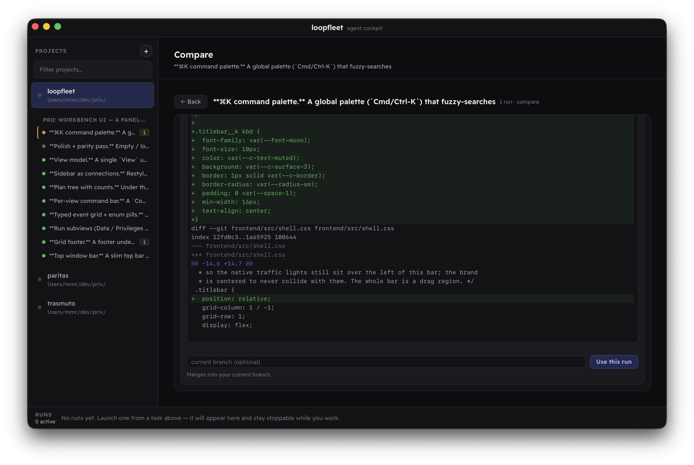

# loopfleet

Loopfleet is an experimental agent cockpit for automatically running loops over your agent project requirements (aka ralph looping over your PRDs). Run separate variants in different worktrees, compare diffs, approve the one you think is best. Spin it up w/ any agent (claude/pi/cursor/codex/misc).

> Heavily WIP.



## Run (for now)

```sh
npm run tauri dev
```

See [build/README.md](build/README.md) for prerequisites and release builds.
