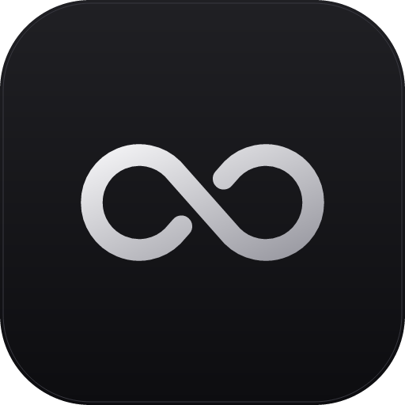
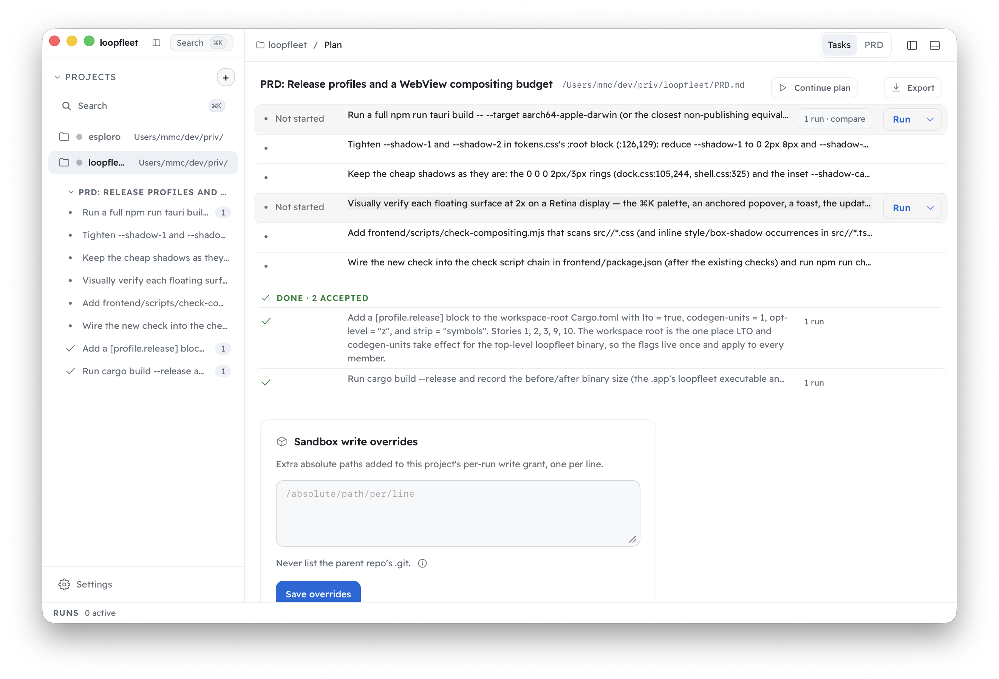

#  loopfleet

Agent cockpit for spec-and-loop driven development.

  

Write a PRD, break it into tasks, and let coding agents loop on them until every task is accepted. 🚀
loopfleet is a native macOS app that keeps the plan, the runs, and the resulting diffs in one place.

## Download 📦

### [🍎 Download for Apple Silicon](https://github.com/matija/loopfleet/releases/latest/download/loopfleet-apple-silicon.dmg) &nbsp;·&nbsp; [💻 Download for Intel](https://github.com/matija/loopfleet/releases/latest/download/loopfleet-intel.dmg)

Signed and notarized `.dmg` builds — the app updates itself from there. ✨
All releases: [github.com/matija/loopfleet/releases](https://github.com/matija/loopfleet/releases)

> WIP.

## Build from source 🛠️

See [`build/README.md`](build/README.md).
