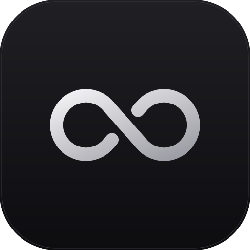
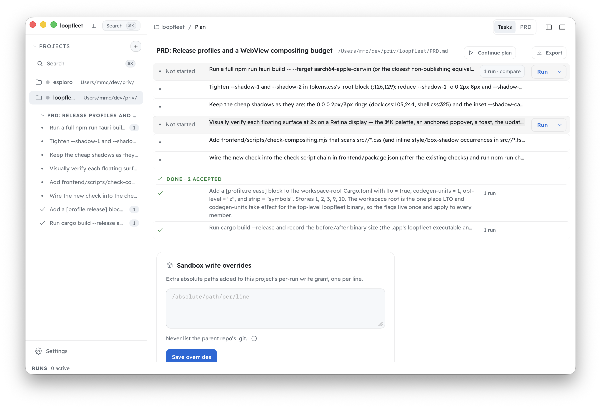
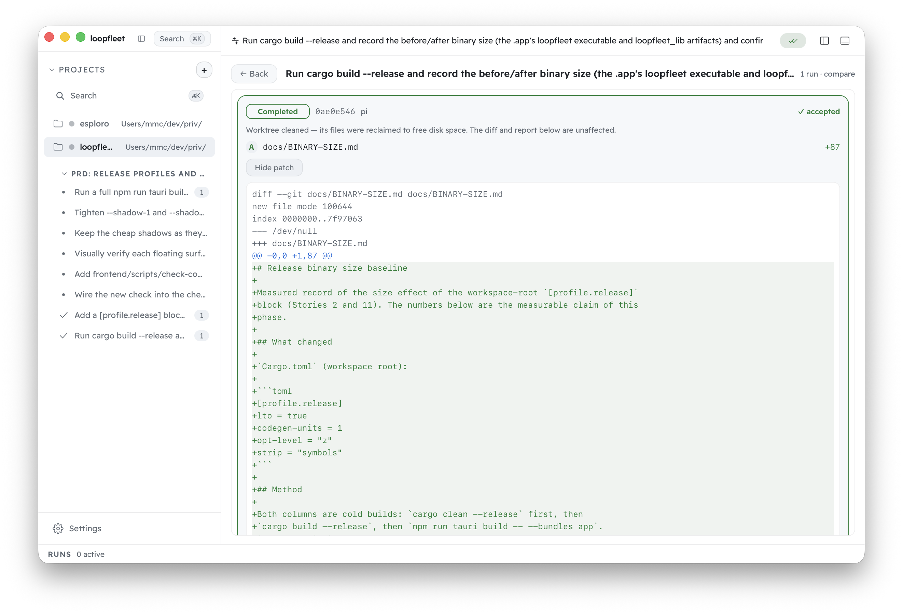

# Loopfleet 

Agent cockpit for spec-and-loop driven development.

  
   <em>Fleet view — every scheduled run, its harness, model, and status at a glance.</em>

  
   <em>Diff review — inspect exactly what each agent produced before accepting a task.</em>

Write a PRD, break it into tasks, and let coding agents loop on them until every task is accepted. 🚀

Loopfleet is a native macOS app for **scheduled and continuous task execution**. Choose Claude, Codex, pi, or Cursor for each run. Select a model and a schedule. The agents work through your task list until you accept each task.

Context is kept deliberately small per run, so each agent stays focused on its current task instead of drowning in accumulated history. The app keeps the plan, the runs, and the resulting diffs in one place: scan the fleet, review what changed, and accept or reject tasks without losing the thread.

## Download

<!-- download-links:start -->
**Download Loopfleet 0.2.1** —
[Apple Silicon](https://github.com/matija/loopfleet/releases/download/0.2.1/Loopfleet_0.2.1_aarch64.dmg)
· [Intel](https://github.com/matija/loopfleet/releases/download/0.2.1/Loopfleet_0.2.1_x64.dmg)
<!-- download-links:end -->

Signed and notarized `.dmg` builds; the app updates itself from there.
Older builds: [all releases](https://github.com/matija/loopfleet/releases).

> WIP.

## Build from source 🛠️

See [`build/README.md`](build/README.md).
